# Guide

[中文](./doc/README_ZH.md)

---

## Definition of Terms

Source network: The network from which funds are transferred to and from an account in a cross-chain transfer

Target network: The network to which the funds are transferred in a cross-chain transfer

## Network

You must set up the correct source and target networks before you can transfer funds across the chain.
When the source network is not selected, you will not be able to see any of the form options associated with the transfer.
When the target network is not selected, some form options will not be available and the transfer will not be completed.

### Network selection

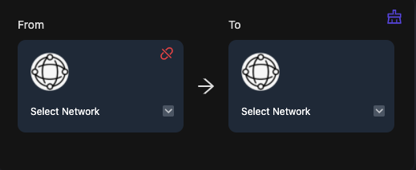

Source network: click on the network on the left to select the source network

Target network: click on the network on the right to select the target network

- Whether you select the source network or the target network first is entirely up to you. Note that once you have selected the source network, the number and type of target networks will change accordingly and only those networks that can undergo cross-chain transfers from the selected source network will be displayed in the target network menu. Conversely, if you select the target network first, then the networks available in the source network menu will change accordingly.

- If you want to see all available source (target) networks, you need to clear the target (source) network

### Connect

Once you have selected the source network, you can connect to the corresponding network by clicking on the corresponding button below

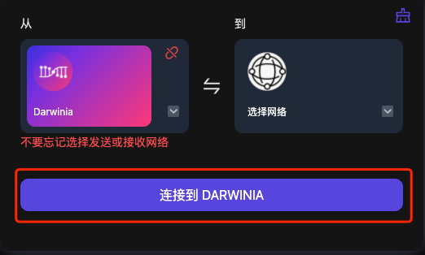

Clicking on this will connect you to the source network of your choice.

If the source network has changed after a successful connection, you will need to re-initiate the connection by clicking on the switch button

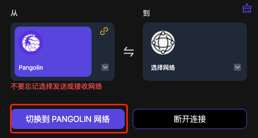

### Disconnect

After the network has been successfully connected, you can find the disconnect button in the bottom right corner of the transfer panel, which will disconnect you from the current network when you click on it

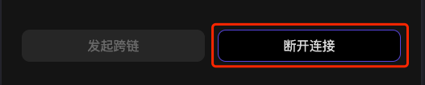

### Network Status

You can find the network connection status in the top right corner of the source network selection panel

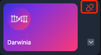

- Red: the network is currently disconnected

- Green: the network is connected to the selected source network

- Yellow: the network is connected, but the connected network does not match the selected source network

### Quick Switch & Reset

Switch between the source and target networks by clicking on the switch icon between the source and target networks

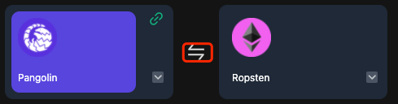

Quickly clear the selected source and target networks by clicking on the clear icon in the top right corner of the network selection panel

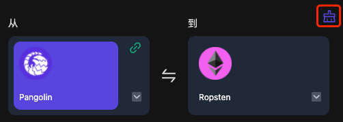

### Show/hide test network

By default, only the official network is displayed in the network selection panel. If you wish to use a test network, you can turn it on or off by clicking on the switch in the top right corner of the site.
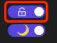

Once you have allowed the test network to be displayed, you can see the test network options when selecting a network.

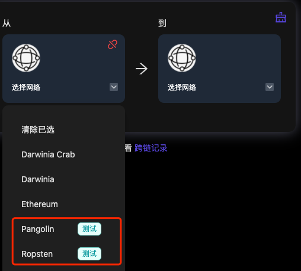

## Cross-chain

Once the networks have been set up, you can see the form entries that need to be filled in to complete the current cross-chain operation.

### Transfer Flow

When the form is completed and the page is error-free, you can click on the Initiate cross-chain button in the bottom left corner of the panel to perform the transfer operation.

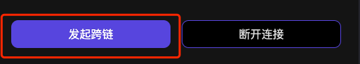

The complete transfer process usually consists of the following (using Pangolin to Ropsten as an example).

1. fill in the transfer form, making sure that the options are correct
   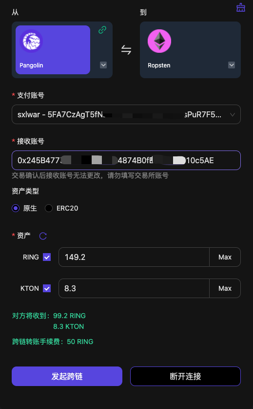
1. Click on the cross-chain button to enter the transfer process
1. Confirm the assets and the amount to be transferred
   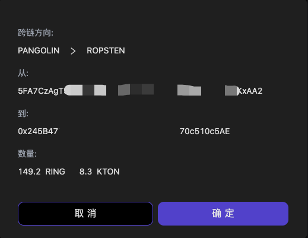
1. Source network authorization
   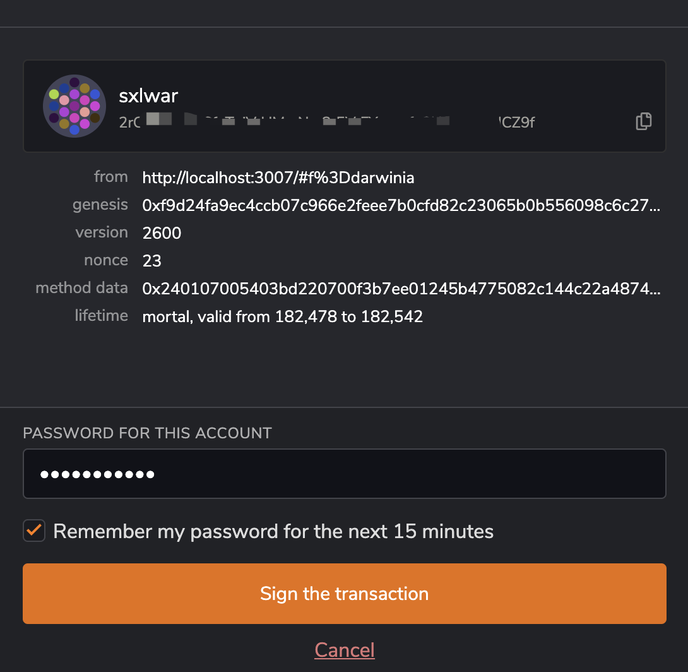
1. Receive an alert that the transfer is complete
   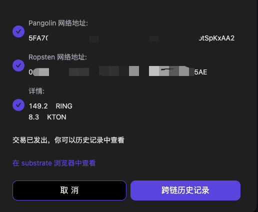

After clicking on the cross-chain button, you will see an indication of the progress of the transfer in the top right corner of the page.

### Fee

The form information required for each cross-link operation is generally different, so please refer to the actual form for details.

Please ensure that the balance in your transfer account is sufficient to cover the fee. The amount of the fee will be queried in real time at the time of the cross-chain operation, please refer to the actual result.

### Special Items

Some cross-chain transfers require special conditions, e.g.

#### Ethereum To Darwinia

When the transfer amount is filled in, if the authorization amount is not sufficient, the following error will appear. This is usually the case when transferring funds for the first time using an account.

### ERC20

Stay tuned!
