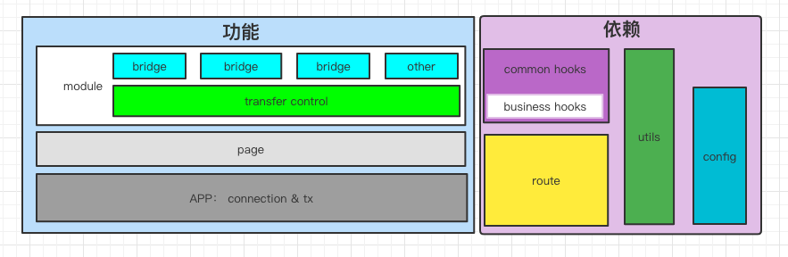
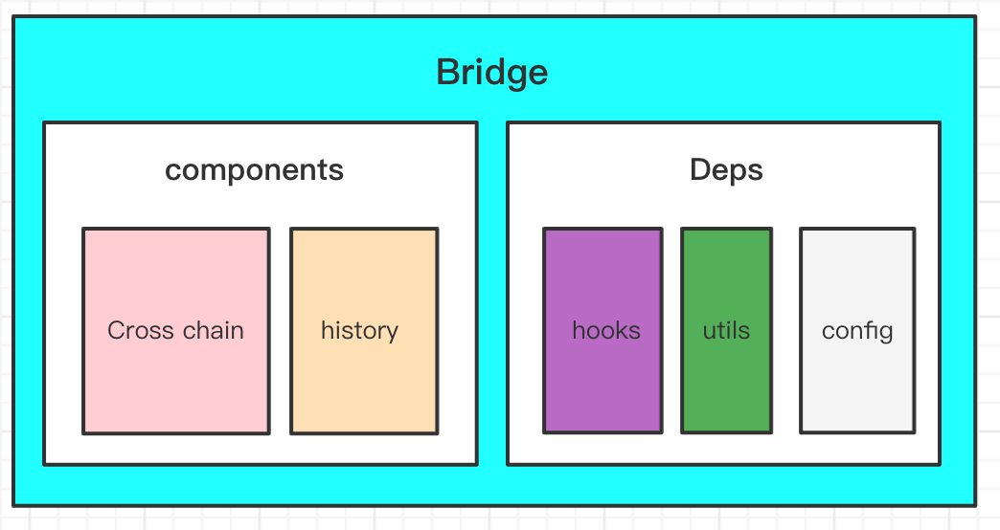

# 开发文档

## 项目架构

- 网络连接在 App 级别进行；主连接：源链的网络连接；副连接：目标链的网络连接；其它连接由使用者检索或发起

- 桥模块主要包含两类组件，跨链及历史记录，具有特有的依赖项

## 如何开发

### 前置知识

桥实现过程中的两个关键环节（连接网络和交易逻辑）都采用了 rxjs 的 Observable 形式的接口，开发者需要对观察者模式及 rxjs 有基本的了解。

### 开发步骤

开发步骤实际没有先后顺序，由开发者自由决定，以下是建议采用的开发步骤：

1. 添加网络配置：检查 src/config/network/ 下是否有所需的网络，若所需的网络已存在，可跳过此步骤

1. 添加网络连接。已经实现的连接： metamask，polkadot，tron；如需实现其它连接，可在 src/utils/connection/connection.ts 添加相应的连接方法，需要遵循统一接口，返回 Observable<Connection>

1. 运行 yarn init:bridge 或 npm run init:bridge，执行完成后会生成相应的目录级基础代码，完成相应组件开发
